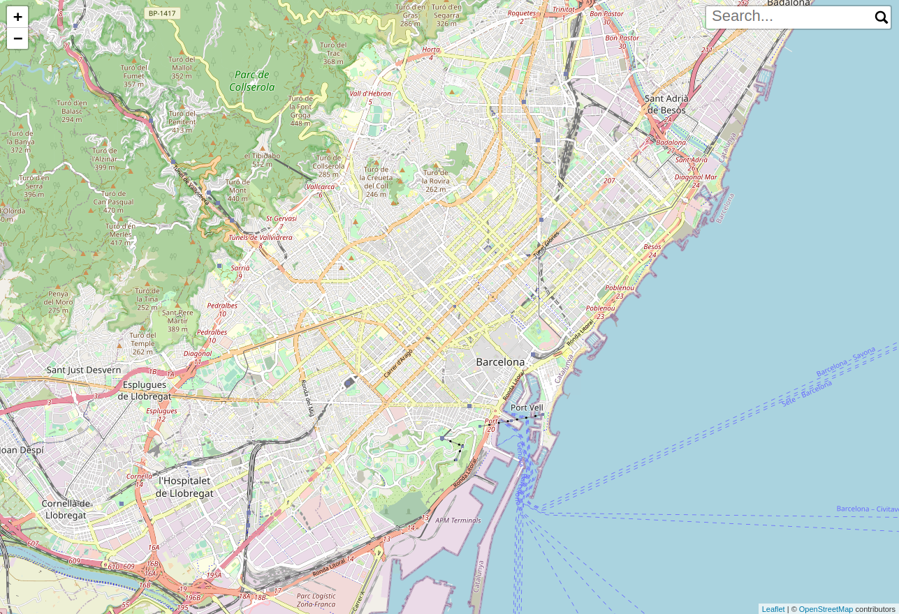
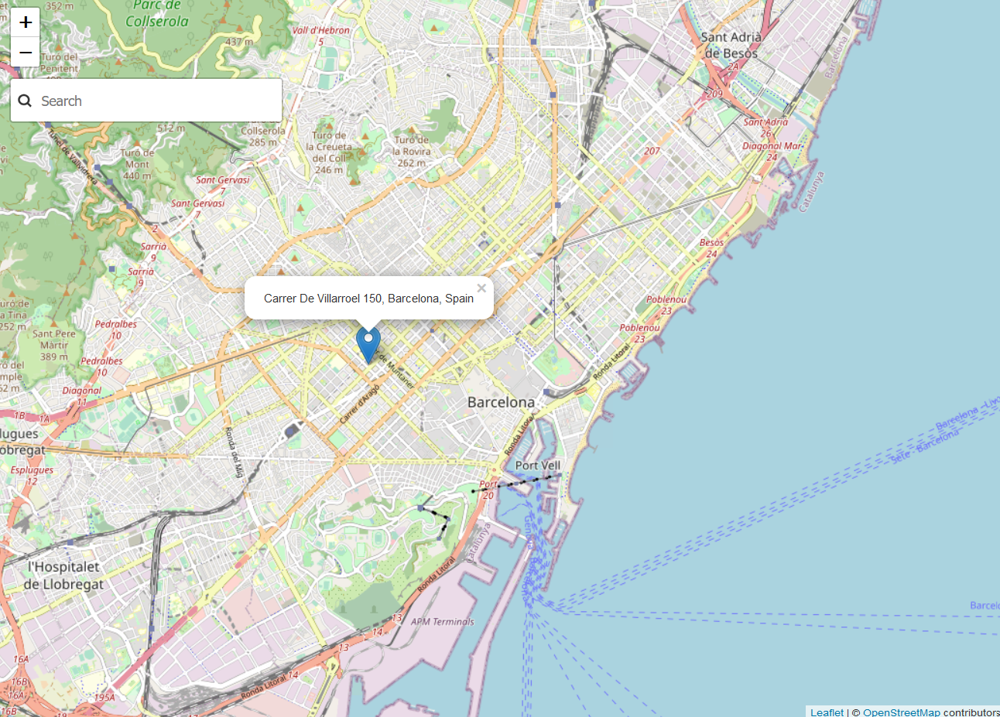

# Ejemplo Geocodificador

La geocodificación de direcciones consiste en la localización espacial de una dirección específica.

Existen dos tipos de geocodificación: 

* **directa** es la obtención de coordenadas a partir de una dirección postal
* **inversa** es la localización de direcciones a partir de coordenadas geográficas

## Creación de un visor que permita buscar direcciones y topónimos

Para crear un visor de mapas utilizaremos la librería de mapas Leaflet [^1]. Y cargaremos los datos del Geocodificador del ICGC

!!! warning "Advertencia"
	El servicio de geodificación del ICGC que utilizaremos es un servicio **beta** en fase de prueba

- Crear una carpeta con el nombre de *visor-geocoder*.

- Crear un archivo con el nombre de *index.html* dentro de la carpeta.

- Abrir el archivo index.html con un editor de texto y copiar el siguiente código.

```html
<!DOCTYPE html>
<html>
<head>
	<title>Ejemplo geocoder</title>
	<link rel="stylesheet" href="https://unpkg.com/leaflet@1.7.1/dist/leaflet.css" />
		<style>
				#map {
						position: absolute;
						top: 0;
						left: 0;
						bottom: 0;
						right: 0;
				}
		</style>
</head>
<body>
	<div id="map"></div>

		<script src="https://unpkg.com/leaflet@1.7.1/dist/leaflet.js"></script>
		<script type="text/javascript">
			var map = L.map('map');

			map.setView([41.3887, 2.1777], 13);
			

		L.tileLayer('http://{s}.tile.osm.org/{z}/{x}/{y}.png', {
				attribution: '&copy; <a href="http://osm.org/copyright">OpenStreetMap</a> contributors'
		}).addTo(map);
		
		</script>
</body>
</html>
```

-  Abrir el archivo index.html en el navegador para comprobar que se carga un mapa centrado en Barcelona.

-  Descargar en la carpeta el plugin desarrollado por el ICGC [^2] https://github.com/OpenICGC/leaflet-geocodericgc-plugin/blob/master/js/leaflet-geocoder.js

- Modificar el plugin para adaptarlo a los últimos cambios. Abrir el archivo descargado leaflet-geocoder.js y modificarlo:

	- Buscar el texto (línea 433) *var url = this.options.url  + '/search';* y remplazarlo por **var url = this.options.url  + '/cerca';**
	- Buscar el texto (línea 448) *var url = this.options.url + '/autocomplete';* y remplazarlo por **var url = this.options.url + '/autocompletar';**

- Agregar el plugin al mapa

```html hl_lines="20 21 32 33 34 35 36 37 38"
<!DOCTYPE html>
<html>
<head>
	<title>Ejemplo geocoder</title>
	<link rel="stylesheet" href="https://unpkg.com/leaflet@1.7.1/dist/leaflet.css" />
		<style>
				#map {
						position: absolute;
						top: 0;
						left: 0;
						bottom: 0;
						right: 0;
				}
		</style>
</head>
<body>
	<div id="map"></div>

		<script src="https://unpkg.com/leaflet@1.7.1/dist/leaflet.js"></script>
        <!-- Load geocoding plugin after Leaflet -->
		<script src="leaflet-geocoder.js"></script>

		<script type="text/javascript">
			var map = L.map('map');

			map.setView([41.3887, 2.1777], 13);
			
		L.tileLayer('http://{s}.tile.osm.org/{z}/{x}/{y}.png', {
				attribution: '&copy; <a href="http://osm.org/copyright">OpenStreetMap</a> contributors'
		}).addTo(map);

        var geocodingOptions = {      
            url:'https://aws.icgc.cat/geocodificador/',
            expanded: true,
            autocomplete: true,
            focus:false
            };
        L.control.geocoder(geocodingOptions).addTo(map);
		
		</script>
</body>
</html>
```

- Recargamos el mapa en el navegador y podemos ver que nos aparece una cája de búsqueda en el mapa (de momento si estilo)

- Cargar la hoja de estilo del plugin

```html hl_lines="6"
<!DOCTYPE html>
<html>
<head>
	<title>Ejemplo geocoder</title>
	<link rel="stylesheet" href="https://unpkg.com/leaflet@1.7.1/dist/leaflet.css" />
    <link rel="stylesheet" href="https://cdnjs.cloudflare.com/ajax/libs/leaflet-geocoder-mapzen/1.9.4/leaflet-geocoder-mapzen.css">
		<style>
				#map {
						position: absolute;
						top: 0;
						left: 0;
						bottom: 0;
						right: 0;
				}
		</style>
</head>
<body>
	<div id="map"></div>

		<script src="https://unpkg.com/leaflet@1.7.1/dist/leaflet.js"></script>
        <!-- Load geocoding plugin after Leaflet -->
		<script src="leaflet-geocoder.js"></script>

		<script type="text/javascript">
			var map = L.map('map');

			map.setView([41.3887, 2.1777], 13);
			
		L.tileLayer('http://{s}.tile.osm.org/{z}/{x}/{y}.png', {
				attribution: '&copy; <a href="http://osm.org/copyright">OpenStreetMap</a> contributors'
		}).addTo(map);

        var geocodingOptions = {      
            url:'https://aws.icgc.cat/geocodificador/',
            expanded: true,
            autocomplete: true,
            focus:false
            };
        L.control.geocoder(geocodingOptions).addTo(map);
		
		</script>
</body>
</html>
```

- Recargamos el mapa en el navegador y vemos que el control ahora si tiene estilo


*ejemplo geocodificador*

## Geocodificación inversa

Implementaremos la funcionalidad que cuando el usuaio haga click en el mapa se busque la dirección o topónimo más cercano.

- Capturar el evento click en el mapa.

```html hl_lines="41 42 43"
<!DOCTYPE html>
<html>
<head>
	<title>Ejemplo geocoder</title>
	<link rel="stylesheet" href="https://unpkg.com/leaflet@1.7.1/dist/leaflet.css" />
    <link rel="stylesheet" href="https://cdnjs.cloudflare.com/ajax/libs/leaflet-geocoder-mapzen/1.9.4/leaflet-geocoder-mapzen.css">
		<style>
				#map {
						position: absolute;
						top: 0;
						left: 0;
						bottom: 0;
						right: 0;
				}
		</style>
</head>
<body>
	<div id="map"></div>

		<script src="https://unpkg.com/leaflet@1.7.1/dist/leaflet.js"></script>
        <!-- Load geocoding plugin after Leaflet -->
		<script src="leaflet-geocoder.js"></script>

		<script type="text/javascript">
			var map = L.map('map');

			map.setView([41.3887, 2.1777], 13);
			
		L.tileLayer('http://{s}.tile.osm.org/{z}/{x}/{y}.png', {
				attribution: '&copy; <a href="http://osm.org/copyright">OpenStreetMap</a> contributors'
		}).addTo(map);

        var geocodingOptions = {      
            url:'https://aws.icgc.cat/geocodificador/',
            expanded: true,
            autocomplete: true,
            focus:false
            };
        L.control.geocoder(geocodingOptions).addTo(map);

        map.on('click', function(e){
            console.log(e);
		});
		
		</script>
</body>
</html>
```

- Recargar la aplicación y abrir la consola del desarrollador, al hacer click sobre el mapa ver que en la consola aparece el objeto del evento click. Inspeccionar este objeto para ver que tiene una propiedad llamada latlng que contine las coordenadas donde se ha hecho el click.

- Llamar al servicio de geocodificación pasandole las coordenadas del click para obtener los elementos

```html hl_lines="43 44 45 46 47 48 49 50 51 52"
<!DOCTYPE html>
<html>
<head>
	<title>Ejemplo geocoder</title>
	<link rel="stylesheet" href="https://unpkg.com/leaflet@1.7.1/dist/leaflet.css" />
    <link rel="stylesheet" href="https://cdnjs.cloudflare.com/ajax/libs/leaflet-geocoder-mapzen/1.9.4/leaflet-geocoder-mapzen.css">
		<style>
				#map {
						position: absolute;
						top: 0;
						left: 0;
						bottom: 0;
						right: 0;
				}
		</style>
</head>
<body>
	<div id="map"></div>

		<script src="https://unpkg.com/leaflet@1.7.1/dist/leaflet.js"></script>
        <!-- Load geocoding plugin after Leaflet -->
		<script src="leaflet-geocoder.js"></script>

		<script type="text/javascript">
			var map = L.map('map');

			map.setView([41.3887, 2.1777], 13);
			
		L.tileLayer('http://{s}.tile.osm.org/{z}/{x}/{y}.png', {
				attribution: '&copy; <a href="http://osm.org/copyright">OpenStreetMap</a> contributors'
		}).addTo(map);

        var geocodingOptions = {      
            url:'https://aws.icgc.cat/geocodificador/',
            expanded: true,
            autocomplete: true,
            focus:false
            };
        L.control.geocoder(geocodingOptions).addTo(map);

        map.on('click', function(e){
            console.log(e);
            var url = `https://aws.icgc.cat/geocodificador/invers?lat=${e.latlng.lat}&lon=${e.latlng.lng}`;
            fetch(url)
            .then(function(response) {
            response.json().then(function(data){
                console.log(data);
            });
            })
            .catch(function(myJson) {
            console.log(myJson);
            });
		});
		
		</script>
</body>
</html>
```

- Recargar la aplicación y abrir la consola del desarrollador, al hacer click sobre el mapa ver que en la consola aparece el objeto de respuesta del geocodificador. 

- Al recibir la respuesta mostrar un marcador en el mapa en la posición donde el usuario hizo el click.

```html hl_lines="48 49"
<!DOCTYPE html>
<html>
<head>
	<title>Ejemplo geocoder</title>
	<link rel="stylesheet" href="https://unpkg.com/leaflet@1.7.1/dist/leaflet.css" />
    <link rel="stylesheet" href="https://cdnjs.cloudflare.com/ajax/libs/leaflet-geocoder-mapzen/1.9.4/leaflet-geocoder-mapzen.css">
		<style>
				#map {
						position: absolute;
						top: 0;
						left: 0;
						bottom: 0;
						right: 0;
				}
		</style>
</head>
<body>
	<div id="map"></div>

		<script src="https://unpkg.com/leaflet@1.7.1/dist/leaflet.js"></script>
        <!-- Load geocoding plugin after Leaflet -->
		<script src="leaflet-geocoder.js"></script>

		<script type="text/javascript">
			var map = L.map('map');

			map.setView([41.3887, 2.1777], 13);
			
		L.tileLayer('http://{s}.tile.osm.org/{z}/{x}/{y}.png', {
				attribution: '&copy; <a href="http://osm.org/copyright">OpenStreetMap</a> contributors'
		}).addTo(map);

        var geocodingOptions = {      
            url:'https://aws.icgc.cat/geocodificador/',
            expanded: true,
            autocomplete: true,
            focus:false
            };
        L.control.geocoder(geocodingOptions).addTo(map);

        map.on('click', function(e){
            console.log(e);
            var url = `https://aws.icgc.cat/geocodificador/invers?lat=${e.latlng.lat}&lon=${e.latlng.lng}`;
            fetch(url)
            .then(function(response) {
            response.json().then(function(data){
                console.log(data);
                var marker = new L.marker(e.latlng);
                map.addLayer(marker);
            });
            })
            .catch(function(myJson) {
            console.log(myJson);
            });
		});
		
		</script>
</body>
</html>
```

- Recargar el mapa y ver que aparece un marcador al hacer click sobre el mapa.

- Mostrar la etiqueta con la dirección retornada de la primera respuesta del geocodificador.

```html hl_lines="48 49 51"
<!DOCTYPE html>
<html>
<head>
	<title>Ejemplo geocoder</title>
	<link rel="stylesheet" href="https://unpkg.com/leaflet@1.7.1/dist/leaflet.css" />
    <link rel="stylesheet" href="https://cdnjs.cloudflare.com/ajax/libs/leaflet-geocoder-mapzen/1.9.4/leaflet-geocoder-mapzen.css">
		<style>
				#map {
						position: absolute;
						top: 0;
						left: 0;
						bottom: 0;
						right: 0;
				}
		</style>
</head>
<body>
	<div id="map"></div>

		<script src="https://unpkg.com/leaflet@1.7.1/dist/leaflet.js"></script>
        <!-- Load geocoding plugin after Leaflet -->
		<script src="leaflet-geocoder.js"></script>

		<script type="text/javascript">
			var map = L.map('map');

			map.setView([41.3887, 2.1777], 13);
			
		L.tileLayer('http://{s}.tile.osm.org/{z}/{x}/{y}.png', {
				attribution: '&copy; <a href="http://osm.org/copyright">OpenStreetMap</a> contributors'
		}).addTo(map);

        var geocodingOptions = {      
            url:'https://aws.icgc.cat/geocodificador/',
            expanded: true,
            autocomplete: true,
            focus:false
            };
        L.control.geocoder(geocodingOptions).addTo(map);

        map.on('click', function(e){
            console.log(e);
            var url = `https://aws.icgc.cat/geocodificador/invers?lat=${e.latlng.lat}&lon=${e.latlng.lng}`;
            fetch(url)
            .then(function(response) {
            response.json().then(function(data){
                console.log(data);
                var etiqueta = data.features[0].properties.label;
                var marker = new L.marker(e.latlng).bindPopup(etiqueta);
                map.addLayer(marker);
                marker.openPopup();
            });
            })
            .catch(function(myJson) {
            console.log(myJson);
            });
		});
		
		</script>
</body>
</html>
```

- Recargar el mapa y ver que aparece la etiqueta.


*ejemplo etiqueta geocodificador*

- Mostrar el marcador en la posición de la primera respuesta del geocodificador y no en la posición del click

```html hl_lines="49 50"
<!DOCTYPE html>
<html>
<head>
	<title>Ejemplo geocoder</title>
	<link rel="stylesheet" href="https://unpkg.com/leaflet@1.7.1/dist/leaflet.css" />
    <link rel="stylesheet" href="https://cdnjs.cloudflare.com/ajax/libs/leaflet-geocoder-mapzen/1.9.4/leaflet-geocoder-mapzen.css">
		<style>
				#map {
						position: absolute;
						top: 0;
						left: 0;
						bottom: 0;
						right: 0;
				}
		</style>
</head>
<body>
	<div id="map"></div>

		<script src="https://unpkg.com/leaflet@1.7.1/dist/leaflet.js"></script>
        <!-- Load geocoding plugin after Leaflet -->
		<script src="leaflet-geocoder.js"></script>

		<script type="text/javascript">
			var map = L.map('map');

			map.setView([41.3887, 2.1777], 13);
			
		L.tileLayer('http://{s}.tile.osm.org/{z}/{x}/{y}.png', {
				attribution: '&copy; <a href="http://osm.org/copyright">OpenStreetMap</a> contributors'
		}).addTo(map);

        var geocodingOptions = {      
            url:'https://aws.icgc.cat/geocodificador/',
            expanded: true,
            autocomplete: true,
            focus:false
            };
        L.control.geocoder(geocodingOptions).addTo(map);

        map.on('click', function(e){
            console.log(e);
            var url = `https://aws.icgc.cat/geocodificador/invers?lat=${e.latlng.lat}&lon=${e.latlng.lng}`;
            fetch(url)
            .then(function(response) {
            response.json().then(function(data){
                console.log(data);
                var etiqueta = data.features[0].properties.label;
                var posicion = data.features[0].geometry.coordinates;
                var marker = new L.marker(posicion).bindPopup(etiqueta);
                map.addLayer(marker);
                marker.openPopup();
            });
            })
            .catch(function(myJson) {
            console.log(myJson);
            });
		});
		
		</script>
</body>
</html>
```

- Recargar el mapa y hacer click sobre el mapa. Vemos que se nos muestra un marcador en Africa. Esto es por que el marker espera las coordenadas en lat, lon y el geojson de respuesta del geocodificador retorna las coordenadas en lon, lat.

- Cambiar el orden de coordenadas para mostrar el marker en la posición correcta

```html hl_lines="50"
<!DOCTYPE html>
<html>
<head>
	<title>Ejemplo geocoder</title>
	<link rel="stylesheet" href="https://unpkg.com/leaflet@1.7.1/dist/leaflet.css" />
    <link rel="stylesheet" href="https://cdnjs.cloudflare.com/ajax/libs/leaflet-geocoder-mapzen/1.9.4/leaflet-geocoder-mapzen.css">
		<style>
				#map {
						position: absolute;
						top: 0;
						left: 0;
						bottom: 0;
						right: 0;
				}
		</style>
</head>
<body>
	<div id="map"></div>

		<script src="https://unpkg.com/leaflet@1.7.1/dist/leaflet.js"></script>
        <!-- Load geocoding plugin after Leaflet -->
		<script src="leaflet-geocoder.js"></script>

		<script type="text/javascript">
			var map = L.map('map');

			map.setView([41.3887, 2.1777], 13);
			
		L.tileLayer('http://{s}.tile.osm.org/{z}/{x}/{y}.png', {
				attribution: '&copy; <a href="http://osm.org/copyright">OpenStreetMap</a> contributors'
		}).addTo(map);

        var geocodingOptions = {      
            url:'https://aws.icgc.cat/geocodificador/',
            expanded: true,
            autocomplete: true,
            focus:false
            };
        L.control.geocoder(geocodingOptions).addTo(map);

        map.on('click', function(e){
            console.log(e);
            var url = `https://aws.icgc.cat/geocodificador/invers?lat=${e.latlng.lat}&lon=${e.latlng.lng}`;
            fetch(url)
            .then(function(response) {
            response.json().then(function(data){
                console.log(data);
                var etiqueta = data.features[0].properties.label;
                var posicion = data.features[0].geometry.coordinates;
                var marker = new L.marker([posicion[1],posicion[0]]).bindPopup(etiqueta);
                map.addLayer(marker);
                marker.openPopup();
            });
            })
            .catch(function(myJson) {
            console.log(myJson);
            });
		});
		
		</script>
</body>
</html>
```

!!! question "Ejercicios 2 pts"
	1. Mostrar la propiedad layer junto con la dirección en la etiqueta (1 pt)

    2. **Extra**: Al hacer click en el mapa mostrar los marcadores de los 3 primeros resultados, pero únicamente desplegar la etiqueta de la primera respuesta. (1 pt) 

## Referencias

[^1]: http://leafletjs.com/
[^2]: https://github.com/OpenICGC/leaflet-geocodericgc-plugin
