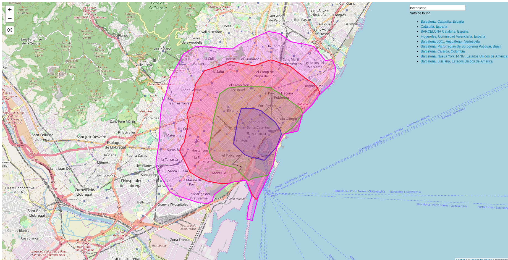

# Ejemplo Mobility

## Creación de un visor que permita el cálculo de Isócronas

Algunos de los servicios que ofrecen el cálculo de Isócronas son: [Targomo](https://www.targomo.com/en/), [ISO4APP](https://www.iso4app.net/), [Openrouteservice](https://openrouteservice.org/) y [Graphhopper](https://www.graphhopper.com/)

- Crear una carpeta con el nombre de *visor-mobility*.
- Crear un archivo con el nombre de *index.html* dentro de la carpeta.
- Abrir el archivo index.html con un editor de texto y copiar el siguiente código.
```html
<!DOCTYPE html>
<html>
<head>
  <meta charset="UTF-8">
  <meta name="viewport" content="width=device-width, initial-scale=1.0">
  <meta http-equiv="X-UA-Compatible" content="ie=edge">
  <title>Ejemplo Isócronas Mapzen</title>
  <link rel="stylesheet" href="https://unpkg.com/leaflet/dist/leaflet.css" />
  <script src="https://unpkg.com/leaflet/dist/leaflet.js"></script>
  <style>
    #map {
      height: 100%;
      width: 100%;
      position: absolute;
    }
  </style>
</head>
<body>
  <div id="map"></div>

  <script>
    var map = L.map('map');

    map.setView([41.3887, 2.1777], 13);

    L.tileLayer('http://{s}.tile.osm.org/{z}/{x}/{y}.png', {
      attribution: '&copy; <a href="http://osm.org/copyright">OpenStreetMap</a> contributors'
    }).addTo(map);
  </script>
</body>
</html>
```

- Abrir el archivo index.html en el navegador para confirmar que se carga un mapa centrado en Barcelona.

- Crear una API key. Al revisar la documentación de la API del servicio de Openrouteservice [^1] vemos que es necesario tener una API key para poder utilizarlo. Para crear la API key hay que darse de alta en la página de Openrouteservice, es un servicio gratuito que tiene unas cuotas de uso.

- Crear una variable donde guardaremos nuestra API key. Escribir antes de la declaración de nuestro mapa

```html hl_lines="22"
<!DOCTYPE html>
<html>
<head>
  <meta charset="UTF-8">
  <meta name="viewport" content="width=device-width, initial-scale=1.0">
  <meta http-equiv="X-UA-Compatible" content="ie=edge">
  <title>Ejemplo Isócronas Mapzen</title>
  <link rel="stylesheet" href="https://unpkg.com/leaflet/dist/leaflet.css" />
  <script src="https://unpkg.com/leaflet/dist/leaflet.js"></script>
  <style>
    #map {
      height: 100%;
      width: 100%;
      position: absolute;
    }
  </style>
</head>
<body>
  <div id="map"></div>

  <script>
    var API_KEY_ORS = 'YOUR-API-KEY';
    
    var map = L.map('map');

    map.setView([41.3887, 2.1777], 13);

    L.tileLayer('http://{s}.tile.osm.org/{z}/{x}/{y}.png', {
      attribution: '&copy; <a href="http://osm.org/copyright">OpenStreetMap</a> contributors'
    }).addTo(map);
  </script>
</body>
</html>
```

- Cargar la respuesta del servicio utilizando el plugin de Leaflet llamado *leaflet.reachability* [^2]. Este plugin permite hacer una llamada al servicio de Openrouteservice y cargar la respuesta en un mapa. Modificar el archivo index.html para cargar el plugin en nuestra aplicación. 

```html hl_lines="10 11"
<!DOCTYPE html>
<html>
<head>
  <meta charset="UTF-8">
  <meta name="viewport" content="width=device-width, initial-scale=1.0">
  <meta http-equiv="X-UA-Compatible" content="ie=edge">
  <title>Ejemplo Isócronas Mapzen</title>
  <link rel="stylesheet" href="https://unpkg.com/leaflet/dist/leaflet.css" />
  <script src="https://unpkg.com/leaflet/dist/leaflet.js"></script>
  <link rel="stylesheet" href="https://cdn.jsdelivr.net/gh/trafforddatalab/leaflet.reachability@v2.0.1/leaflet.reachability.css"/>
  <script src="https://cdn.jsdelivr.net/gh/trafforddatalab/leaflet.reachability@v2.0.1/leaflet.reachability.js"></script>
  <style>
    #map {
      height: 100%;
      width: 100%;
      position: absolute;
    }
  </style>
</head>
<body>
  <div id="map"></div>

  <script>
    var API_KEY_ORS = 'YOUR-API-KEY';

    var map = L.map('map');

    map.setView([41.3887, 2.1777], 13);

    L.tileLayer('http://{s}.tile.osm.org/{z}/{x}/{y}.png', {
      attribution: '&copy; <a href="http://osm.org/copyright">OpenStreetMap</a> contributors'
    }).addTo(map);
  </script>
</body>
</html>
```

- Agregar el control de Isócronas al mapa utilizando el plugin.

```html hl_lines="34-38"
<!DOCTYPE html>
<html>
<head>
  <meta charset="UTF-8">
  <meta name="viewport" content="width=device-width, initial-scale=1.0">
  <meta http-equiv="X-UA-Compatible" content="ie=edge">
  <title>Ejemplo Isócronas Mapzen</title>
  <link rel="stylesheet" href="https://unpkg.com/leaflet/dist/leaflet.css" />
  <script src="https://unpkg.com/leaflet/dist/leaflet.js"></script>
  <link rel="stylesheet" href="https://cdn.jsdelivr.net/gh/trafforddatalab/leaflet.reachability@v2.0.1/leaflet.reachability.css"/>
  <script src="https://cdn.jsdelivr.net/gh/trafforddatalab/leaflet.reachability@v2.0.1/leaflet.reachability.js"></script>
  <style>
    #map {
      height: 100%;
      width: 100%;
      position: absolute;
    }
  </style>
</head>
<body>
  <div id="map"></div>

  <script>
    var API_KEY_ORS = 'YOUR-API-KEY';

    var map = L.map('map');

    map.setView([41.3887, 2.1777], 13);

    L.tileLayer('http://{s}.tile.osm.org/{z}/{x}/{y}.png', {
      attribution: '&copy; <a href="http://osm.org/copyright">OpenStreetMap</a> contributors'
    }).addTo(map);

    // Initialise the reachability plugin
    L.control.reachability({
      // add settings/options here
      apiKey: API_KEY_ORS
    }).addTo(map);
  </script>
</body>
</html>
```

- Recargar el mapa y comprobar que aparece un el botón del control de Isócronas. Abrir la consola del desarrollador y ver las peticiones que se hacen al servicio de Openrouteservice. 

- Modificar la aplicación para que se haga el cálculo de la Isócrona cuando el usuario haga click en un punto del mapa sin utilizar el plugin. Para ello primero hay que detectar el evento click en el mapa.

```html hl_lines="40-42"
<!DOCTYPE html>
<html>
<head>
  <meta charset="UTF-8">
  <meta name="viewport" content="width=device-width, initial-scale=1.0">
  <meta http-equiv="X-UA-Compatible" content="ie=edge">
  <title>Ejemplo Isócronas Mapzen</title>
  <link rel="stylesheet" href="https://unpkg.com/leaflet/dist/leaflet.css" />
  <script src="https://unpkg.com/leaflet/dist/leaflet.js"></script>
  <link rel="stylesheet" href="https://cdn.jsdelivr.net/gh/trafforddatalab/leaflet.reachability@v2.0.1/leaflet.reachability.css"/>
  <script src="https://cdn.jsdelivr.net/gh/trafforddatalab/leaflet.reachability@v2.0.1/leaflet.reachability.js"></script>
  <style>
    #map {
      height: 100%;
      width: 100%;
      position: absolute;
    }
  </style>
</head>
<body>
  <div id="map"></div>

  <script>
    var API_KEY_ORS = 'YOUR-API-KEY';

    var map = L.map('map');

    map.setView([41.3887, 2.1777], 13);

    L.tileLayer('http://{s}.tile.osm.org/{z}/{x}/{y}.png', {
      attribution: '&copy; <a href="http://osm.org/copyright">OpenStreetMap</a> contributors'
    }).addTo(map);

    // Initialise the reachability plugin
    L.control.reachability({
      // add settings/options here
      apiKey: API_KEY_ORS
    }).addTo(map);

    map.on('click', async function(e){
      console.log(e);
    });
  </script>
</body>
</html>
```

- Recargar la aplicación y abrir la consola del desarrollador. Hacer click sobre el mapa y ver que en la consola aparece el objeto del evento click. Inspeccionar este objeto y ver que tiene una propiedad llamada latlng que contiene las coordenadas donde se ha hecho el click.

- Crear una función que tenga como parámetro una posición (coordenada lat lon) y genere una llamada al servicio de isócronas de Openrouteservice para que haga el cálculo en la coordenada indicada. Copiar lo siguiente al final de nuestro código

```html hl_lines="44-66"
<!DOCTYPE html>
<html>
<head>
  <meta charset="UTF-8">
  <meta name="viewport" content="width=device-width, initial-scale=1.0">
  <meta http-equiv="X-UA-Compatible" content="ie=edge">
  <title>Ejemplo Isócronas Mapzen</title>
  <link rel="stylesheet" href="https://unpkg.com/leaflet/dist/leaflet.css" />
  <script src="https://unpkg.com/leaflet/dist/leaflet.js"></script>
  <link rel="stylesheet" href="https://cdn.jsdelivr.net/gh/trafforddatalab/leaflet.reachability@v2.0.1/leaflet.reachability.css"/>
  <script src="https://cdn.jsdelivr.net/gh/trafforddatalab/leaflet.reachability@v2.0.1/leaflet.reachability.js"></script>
  <style>
    #map {
      height: 100%;
      width: 100%;
      position: absolute;
    }
  </style>
</head>
<body>
  <div id="map"></div>

  <script>
    var API_KEY_ORS = 'YOUR-API-KEY';

    var map = L.map('map');

    map.setView([41.3887, 2.1777], 13);

    L.tileLayer('http://{s}.tile.osm.org/{z}/{x}/{y}.png', {
      attribution: '&copy; <a href="http://osm.org/copyright">OpenStreetMap</a> contributors'
    }).addTo(map);

    // Initialise the reachability plugin
    L.control.reachability({
      // add settings/options here
      apiKey: API_KEY_ORS
    }).addTo(map);

    map.on('click', async function(e){
      console.log(e);
    });

    async function getIsochrona(latlng) {
      var lat = latlng.lat;
      var lng = latlng.lng;
      var url = 'https://api.openrouteservice.org/v2/isochrones/cycling-regular';
      var json = {
        locations: [[lng, lat]],
        range_type: "time",
        range: [1200],
        interval: 300,
        location_type: "start"
      };
      const response = await fetch(url, {
        method: 'POST',
        mode: 'cors',
        headers: {
          'Accept': 'application/json, application/geo+json, application/gpx+xml, img/png; charset=utf-8',
          'Content-Type': 'application/json',
          'Authorization': API_KEY_ORS
        },
        body: JSON.stringify(json)
      });
      return await response.json();
    }
  </script>
</body>
</html>
```

- Llamar a la función *getIsochrona* cuando se hace click en el mapa. Escribir al final de la función del click

```html hl_lines="42 43"
<!DOCTYPE html>
<html>
<head>
  <meta charset="UTF-8">
  <meta name="viewport" content="width=device-width, initial-scale=1.0">
  <meta http-equiv="X-UA-Compatible" content="ie=edge">
  <title>Ejemplo Isócronas Mapzen</title>
  <link rel="stylesheet" href="https://unpkg.com/leaflet/dist/leaflet.css" />
  <script src="https://unpkg.com/leaflet/dist/leaflet.js"></script>
  <link rel="stylesheet" href="https://cdn.jsdelivr.net/gh/trafforddatalab/leaflet.reachability@v2.0.1/leaflet.reachability.css"/>
  <script src="https://cdn.jsdelivr.net/gh/trafforddatalab/leaflet.reachability@v2.0.1/leaflet.reachability.js"></script>
  <style>
    #map {
      height: 100%;
      width: 100%;
      position: absolute;
    }
  </style>
</head>
<body>
  <div id="map"></div>

  <script>
    var API_KEY_ORS = 'YOUR-API-KEY';

    var map = L.map('map');

    map.setView([41.3887, 2.1777], 13);

    L.tileLayer('http://{s}.tile.osm.org/{z}/{x}/{y}.png', {
      attribution: '&copy; <a href="http://osm.org/copyright">OpenStreetMap</a> contributors'
    }).addTo(map);

    // Initialise the reachability plugin
    L.control.reachability({
      // add settings/options here
      apiKey: API_KEY_ORS
    }).addTo(map);

    map.on('click', async function(e){
      console.log(e);
      var data = await getIsochrona(e.latlng);
      console.log(data);
    });

    async function getIsochrona(latlng) {
      var lat = latlng.lat;
      var lng = latlng.lng;
      var url = 'https://api.openrouteservice.org/v2/isochrones/cycling-regular';
      var json = {
        locations: [[lng, lat]],
        range_type: "time",
        range: [1200],
        interval: 300,
        location_type: "start"
      };
      const response = await fetch(url, {
        method: 'POST',
        mode: 'cors',
        headers: {
          'Accept': 'application/json, application/geo+json, application/gpx+xml, img/png; charset=utf-8',
          'Content-Type': 'application/json',
          'Authorization': API_KEY_ORS
        },
        body: JSON.stringify(json)
      });
      return await response.json();
    }
  </script>
</body>
</html>
```

- Recargar la página y hacer click sobre el mapa para ver que en la consola aparece un GeoJSON que contiene la isócrona.

- Agregar la una capa geojson que la iniciaremos vacía sin ningún elemento.

```html hl_lines="40"
<!DOCTYPE html>
<html>
<head>
  <meta charset="UTF-8">
  <meta name="viewport" content="width=device-width, initial-scale=1.0">
  <meta http-equiv="X-UA-Compatible" content="ie=edge">
  <title>Ejemplo Isócronas Mapzen</title>
  <link rel="stylesheet" href="https://unpkg.com/leaflet/dist/leaflet.css" />
  <script src="https://unpkg.com/leaflet/dist/leaflet.js"></script>
  <link rel="stylesheet" href="https://cdn.jsdelivr.net/gh/trafforddatalab/leaflet.reachability@v2.0.1/leaflet.reachability.css"/>
  <script src="https://cdn.jsdelivr.net/gh/trafforddatalab/leaflet.reachability@v2.0.1/leaflet.reachability.js"></script>
  <style>
    #map {
      height: 100%;
      width: 100%;
      position: absolute;
    }
  </style>
</head>
<body>
  <div id="map"></div>

  <script>
    var API_KEY_ORS = 'YOUR-API-KEY';

    var map = L.map('map');

    map.setView([41.3887, 2.1777], 13);

    L.tileLayer('http://{s}.tile.osm.org/{z}/{x}/{y}.png', {
      attribution: '&copy; <a href="http://osm.org/copyright">OpenStreetMap</a> contributors'
    }).addTo(map);

    // Initialise the reachability plugin
    L.control.reachability({
      // add settings/options here
      apiKey: API_KEY_ORS
    }).addTo(map);

    var geojsonLayer = new L.geoJSON().addTo(map);
    
    map.on('click', async function(e){
      console.log(e);
      var data = await getIsochrona(e.latlng);
      console.log(data);
    });

    async function getIsochrona(latlng) {
      var lat = latlng.lat;
      var lng = latlng.lng;
      var url = 'https://api.openrouteservice.org/v2/isochrones/cycling-regular';
      var json = {
        locations: [[lng, lat]],
        range_type: "time",
        range: [1200],
        interval: 300,
        location_type: "start"
      };
      const response = await fetch(url, {
        method: 'POST',
        mode: 'cors',
        headers: {
          'Accept': 'application/json, application/geo+json, application/gpx+xml, img/png; charset=utf-8',
          'Content-Type': 'application/json',
          'Authorization': API_KEY_ORS
        },
        body: JSON.stringify(json)
      });
      return await response.json();
    }
  </script>
</body>
</html>
```

- Utilizar el método addData para actualizar la capa geojsonLayer con la respuesta GeoJSON que retorna la API.

```html hl_lines="46"
<!DOCTYPE html>
<html>
<head>
  <meta charset="UTF-8">
  <meta name="viewport" content="width=device-width, initial-scale=1.0">
  <meta http-equiv="X-UA-Compatible" content="ie=edge">
  <title>Ejemplo Isócronas Mapzen</title>
  <link rel="stylesheet" href="https://unpkg.com/leaflet/dist/leaflet.css" />
  <script src="https://unpkg.com/leaflet/dist/leaflet.js"></script>
  <link rel="stylesheet" href="https://cdn.jsdelivr.net/gh/trafforddatalab/leaflet.reachability@v2.0.1/leaflet.reachability.css"/>
  <script src="https://cdn.jsdelivr.net/gh/trafforddatalab/leaflet.reachability@v2.0.1/leaflet.reachability.js"></script>
  <style>
    #map {
      height: 100%;
      width: 100%;
      position: absolute;
    }
  </style>
</head>
<body>
  <div id="map"></div>

  <script>
    var API_KEY_ORS = 'YOUR-API-KEY';

    var map = L.map('map');

    map.setView([41.3887, 2.1777], 13);

    L.tileLayer('http://{s}.tile.osm.org/{z}/{x}/{y}.png', {
      attribution: '&copy; <a href="http://osm.org/copyright">OpenStreetMap</a> contributors'
    }).addTo(map);

    // Initialise the reachability plugin
    L.control.reachability({
      // add settings/options here
      apiKey: API_KEY_ORS
    }).addTo(map);

    var geojsonLayer = new L.geoJSON().addTo(map);

    map.on('click', async function(e){
      console.log(e);
      var data = await getIsochrona(e.latlng);
      console.log(data);
      geojsonLayer.addData(data);
    });

    async function getIsochrona(latlng) {
      var lat = latlng.lat;
      var lng = latlng.lng;
      var url = 'https://api.openrouteservice.org/v2/isochrones/cycling-regular';
      var json = {
        locations: [[lng, lat]],
        range_type: "time",
        range: [1200],
        interval: 300,
        location_type: "start"
      };
      const response = await fetch(url, {
        method: 'POST',
        mode: 'cors',
        headers: {
          'Accept': 'application/json, application/geo+json, application/gpx+xml, img/png; charset=utf-8',
          'Content-Type': 'application/json',
          'Authorization': API_KEY_ORS
        },
        body: JSON.stringify(json)
      });
      return await response.json();
    }
  </script>
</body>
</html>
```

- Refrescar el mapa y hacer click sobre el mapa para comprobar que se dibuja una nueva línea isócrona.

- Pintar la línea del color que indicamos. Por defecto se pinta la línea de color azul. Esto es debido a que el Leaflet no sabe de que color pintar la línea y utiliza el color por defecto. En la respuesta del servicio podemos ver que los elementos que nos retorna tienen unas propiedades (properties) en donde se listan una serie de atributos, uno de ellos es el *value* que corresponde con el valor del intervalo de tiempo. Lo que debemos hacer es decirle al leaflet que utilice esa propiedad para dar el color a la línea. Escribir lo siguiente en nuestra capa geojsonLayer.

```html hl_lines="40-62"
<!DOCTYPE html>
<html>
<head>
  <meta charset="UTF-8">
  <meta name="viewport" content="width=device-width, initial-scale=1.0">
  <meta http-equiv="X-UA-Compatible" content="ie=edge">
  <title>Ejemplo Isócronas Mapzen</title>
  <link rel="stylesheet" href="https://unpkg.com/leaflet/dist/leaflet.css" />
  <script src="https://unpkg.com/leaflet/dist/leaflet.js"></script>
  <link rel="stylesheet" href="https://cdn.jsdelivr.net/gh/trafforddatalab/leaflet.reachability@v2.0.1/leaflet.reachability.css"/>
  <script src="https://cdn.jsdelivr.net/gh/trafforddatalab/leaflet.reachability@v2.0.1/leaflet.reachability.js"></script>
  <style>
    #map {
      height: 100%;
      width: 100%;
      position: absolute;
    }
  </style>
</head>
<body>
  <div id="map"></div>

  <script>
    var API_KEY_ORS = 'YOUR-API-KEY';

    var map = L.map('map');

    map.setView([41.3887, 2.1777], 13);

    L.tileLayer('http://{s}.tile.osm.org/{z}/{x}/{y}.png', {
      attribution: '&copy; <a href="http://osm.org/copyright">OpenStreetMap</a> contributors'
    }).addTo(map);

    // Initialise the reachability plugin
    L.control.reachability({
      // add settings/options here
      apiKey: API_KEY_ORS
    }).addTo(map);

    var geojsonLayer = new L.geoJSON('', {
      style: function (geoJsonFeature) {
        var color = "#0000FF";
        switch (geoJsonFeature.properties.value) {
          case 300:
            color = "#0000FF";
            break;
          case 600:
            color = "#00FF00";
            break;
          case 900:
            color = "#FF0000";
            break;
          case 1200:
            color = "#FF00FF";
            break;
          default:
            color = "#0000FF";
            break;
        }
        return { color: color };
      }
    }).addTo(map);

    map.on('click', async function(e){
      console.log(e);
      var data = await getIsochrona(e.latlng);
      console.log(data);
      geojsonLayer.addData(data);
    });

    async function getIsochrona(latlng) {
      var lat = latlng.lat;
      var lng = latlng.lng;
      var url = 'https://api.openrouteservice.org/v2/isochrones/cycling-regular';
      var json = {
        locations: [[lng, lat]],
        range_type: "time",
        range: [1200],
        interval: 300,
        location_type: "start"
      };
      const response = await fetch(url, {
        method: 'POST',
        mode: 'cors',
        headers: {
          'Accept': 'application/json, application/geo+json, application/gpx+xml, img/png; charset=utf-8',
          'Content-Type': 'application/json',
          'Authorization': API_KEY_ORS
        },
        body: JSON.stringify(json)
      });
      return await response.json();
    }
  </script>
</body>
</html>
```

- Recargar el mapa y hacer click para confirmar que los polígonos se pintan de diferentes colores.

## Agregar un buscador de direcciones y puntos de interés al mapa

Para agregar un buscador utilizaremos el plugin de Leaflet *Leaflet.OpenCage.Search* [^4] desarrollado por OpenCage que permite de una forma fácil y rápida hacer llamadas al servicio de búsqueda de OpenCage Geocoder. Para ello hay que obtener un API_KEY en la página de OpenCage [^5]

- Cargar la librería en nuestra aplicación.

```html hl_lines="12 13"
<!DOCTYPE html>
<html>
<head>
  <meta charset="UTF-8">
  <meta name="viewport" content="width=device-width, initial-scale=1.0">
  <meta http-equiv="X-UA-Compatible" content="ie=edge">
  <title>Ejemplo Isócronas Mapzen</title>
  <link rel="stylesheet" href="https://unpkg.com/leaflet/dist/leaflet.css" />
  <script src="https://unpkg.com/leaflet/dist/leaflet.js"></script>
  <link rel="stylesheet" href="https://cdn.jsdelivr.net/gh/trafforddatalab/leaflet.reachability@v2.0.1/leaflet.reachability.css"/>
  <script src="https://cdn.jsdelivr.net/gh/trafforddatalab/leaflet.reachability@v2.0.1/leaflet.reachability.js"></script>
  <link rel="stylesheet" href="https://cdn.jsdelivr.net/gh/opencagedata/leaflet-opencage-geocoding@v2.0.0/dist/css/L.Control.OpenCageGeocoding.min.css" />
  <script src="https://cdn.jsdelivr.net/gh/opencagedata/leaflet-opencage-geocoding@v2.0.0/dist/js/L.Control.OpenCageGeocoding.min.js"></script>
  <style>
    #map {
      height: 100%;
      width: 100%;
      position: absolute;
    }
  </style>
</head>
<body>
  <div id="map"></div>

  <script>
    var API_KEY_ORS = 'YOUR-API-KEY';

    var map = L.map('map');

    map.setView([41.3887, 2.1777], 13);

    L.tileLayer('http://{s}.tile.osm.org/{z}/{x}/{y}.png', {
      attribution: '&copy; <a href="http://osm.org/copyright">OpenStreetMap</a> contributors'
    }).addTo(map);

    // Initialise the reachability plugin
    L.control.reachability({
      // add settings/options here
      apiKey: API_KEY_ORS
    }).addTo(map);

    var geojsonLayer = new L.geoJSON('', {
      style: function (geoJsonFeature) {
        var color = "#0000FF";
        switch (geoJsonFeature.properties.value) {
          case 300:
            color = "#0000FF";
            break;
          case 600:
            color = "#00FF00";
            break;
          case 900:
            color = "#FF0000";
            break;
          case 1200:
            color = "#FF00FF";
            break;
          default:
            color = "#0000FF";
            break;
        }
        return { color: color };
      }
    }).addTo(map);

    map.on('click', async function(e){
      console.log(e);
      var data = await getIsochrona(e.latlng);
      console.log(data);
      geojsonLayer.addData(data);
    });

    async function getIsochrona(latlng) {
      var lat = latlng.lat;
      var lng = latlng.lng;
      var url = 'https://api.openrouteservice.org/v2/isochrones/cycling-regular';
      var json = {
        locations: [[lng, lat]],
        range_type: "time",
        range: [1200],
        interval: 300,
        location_type: "start"
      };
      const response = await fetch(url, {
        method: 'POST',
        mode: 'cors',
        headers: {
          'Accept': 'application/json, application/geo+json, application/gpx+xml, img/png; charset=utf-8',
          'Content-Type': 'application/json',
          'Authorization': API_KEY_ORS
        },
        body: JSON.stringify(json)
      });
      return await response.json();
    }
  </script>
</body>
</html>
```

- Crear la variable para la API key

```html hl_lines="27"
<!DOCTYPE html>
<html>
<head>
  <meta charset="UTF-8">
  <meta name="viewport" content="width=device-width, initial-scale=1.0">
  <meta http-equiv="X-UA-Compatible" content="ie=edge">
  <title>Ejemplo Isócronas Mapzen</title>
  <link rel="stylesheet" href="https://unpkg.com/leaflet/dist/leaflet.css" />
  <script src="https://unpkg.com/leaflet/dist/leaflet.js"></script>
  <link rel="stylesheet" href="https://cdn.jsdelivr.net/gh/trafforddatalab/leaflet.reachability@v2.0.1/leaflet.reachability.css"/>
  <script src="https://cdn.jsdelivr.net/gh/trafforddatalab/leaflet.reachability@v2.0.1/leaflet.reachability.js"></script>
  <link rel="stylesheet" href="https://cdn.jsdelivr.net/gh/opencagedata/leaflet-opencage-geocoding@v2.0.0/dist/css/L.Control.OpenCageGeocoding.min.css" />
  <script src="https://cdn.jsdelivr.net/gh/opencagedata/leaflet-opencage-geocoding@v2.0.0/dist/js/L.Control.OpenCageGeocoding.min.js"></script>
  <style>
    #map {
      height: 100%;
      width: 100%;
      position: absolute;
    }
  </style>
</head>
<body>
  <div id="map"></div>

  <script>
    var API_KEY_ORS = 'YOUR-API-KEY';
    var API_KEY_OCG = 'TU_API_KEY_OPENCAGE';

    var map = L.map('map');

    map.setView([41.3887, 2.1777], 13);

    L.tileLayer('http://{s}.tile.osm.org/{z}/{x}/{y}.png', {
      attribution: '&copy; <a href="http://osm.org/copyright">OpenStreetMap</a> contributors'
    }).addTo(map);

    // Initialise the reachability plugin
    L.control.reachability({
      // add settings/options here
      apiKey: API_KEY_ORS
    }).addTo(map);

    var geojsonLayer = new L.geoJSON('', {
      style: function (geoJsonFeature) {
        var color = "#0000FF";
        switch (geoJsonFeature.properties.value) {
          case 300:
            color = "#0000FF";
            break;
          case 600:
            color = "#00FF00";
            break;
          case 900:
            color = "#FF0000";
            break;
          case 1200:
            color = "#FF00FF";
            break;
          default:
            color = "#0000FF";
            break;
        }
        return { color: color };
      }
    }).addTo(map);

    map.on('click', async function(e){
      console.log(e);
      var data = await getIsochrona(e.latlng);
      console.log(data);
      geojsonLayer.addData(data);
    });

    async function getIsochrona(latlng) {
      var lat = latlng.lat;
      var lng = latlng.lng;
      var url = 'https://api.openrouteservice.org/v2/isochrones/cycling-regular';
      var json = {
        locations: [[lng, lat]],
        range_type: "time",
        range: [1200],
        interval: 300,
        location_type: "start"
      };
      const response = await fetch(url, {
        method: 'POST',
        mode: 'cors',
        headers: {
          'Accept': 'application/json, application/geo+json, application/gpx+xml, img/png; charset=utf-8',
          'Content-Type': 'application/json',
          'Authorization': API_KEY_ORS
        },
        body: JSON.stringify(json)
      });
      return await response.json();
    }
  </script>
</body>
</html>
```

- Agregar el control al mapa. Para utilizar el servicio de búsqueda también es necesario pasar nuestra API key:

```html hl_lines="43-47"
<!DOCTYPE html>
<html>
<head>
  <meta charset="UTF-8">
  <meta name="viewport" content="width=device-width, initial-scale=1.0">
  <meta http-equiv="X-UA-Compatible" content="ie=edge">
  <title>Ejemplo Isócronas Mapzen</title>
  <link rel="stylesheet" href="https://unpkg.com/leaflet/dist/leaflet.css" />
  <script src="https://unpkg.com/leaflet/dist/leaflet.js"></script>
  <link rel="stylesheet" href="https://cdn.jsdelivr.net/gh/trafforddatalab/leaflet.reachability@v2.0.1/leaflet.reachability.css"/>
  <script src="https://cdn.jsdelivr.net/gh/trafforddatalab/leaflet.reachability@v2.0.1/leaflet.reachability.js"></script>
  <link rel="stylesheet" href="https://cdn.jsdelivr.net/gh/opencagedata/leaflet-opencage-geocoding@v2.0.0/dist/css/L.Control.OpenCageGeocoding.min.css" />
  <script src="https://cdn.jsdelivr.net/gh/opencagedata/leaflet-opencage-geocoding@v2.0.0/dist/js/L.Control.OpenCageGeocoding.min.js"></script>
  <style>
    #map {
      height: 100%;
      width: 100%;
      position: absolute;
    }
  </style>
</head>
<body>
  <div id="map"></div>

  <script>
    var API_KEY_ORS = 'YOUR-API-KEY';
    var API_KEY_OCG = 'TU_API_KEY_OPENCAGE';

    var map = L.map('map');

    map.setView([41.3887, 2.1777], 13);

    L.tileLayer('http://{s}.tile.osm.org/{z}/{x}/{y}.png', {
      attribution: '&copy; <a href="http://osm.org/copyright">OpenStreetMap</a> contributors'
    }).addTo(map);

    // Initialise the reachability plugin
    L.control.reachability({
      // add settings/options here
      apiKey: API_KEY_ORS
    }).addTo(map);

    var options = {
      key: API_KEY_OCG,
      limit: 10,
    };
    var geocoder = L.Control.openCageGeocoding(options).addTo(map);

    var geojsonLayer = new L.geoJSON('', {
      style: function (geoJsonFeature) {
        var color = "#0000FF";
        switch (geoJsonFeature.properties.value) {
          case 300:
            color = "#0000FF";
            break;
          case 600:
            color = "#00FF00";
            break;
          case 900:
            color = "#FF0000";
            break;
          case 1200:
            color = "#FF00FF";
            break;
          default:
            color = "#0000FF";
            break;
        }
        return { color: color };
      }
    }).addTo(map);

    map.on('click', async function(e){
      console.log(e);
      var data = await getIsochrona(e.latlng);
      console.log(data);
      geojsonLayer.addData(data);
    });

    async function getIsochrona(latlng) {
      var lat = latlng.lat;
      var lng = latlng.lng;
      var url = 'https://api.openrouteservice.org/v2/isochrones/cycling-regular';
      var json = {
        locations: [[lng, lat]],
        range_type: "time",
        range: [1200],
        interval: 300,
        location_type: "start"
      };
      const response = await fetch(url, {
        method: 'POST',
        mode: 'cors',
        headers: {
          'Accept': 'application/json, application/geo+json, application/gpx+xml, img/png; charset=utf-8',
          'Content-Type': 'application/json',
          'Authorization': API_KEY_ORS
        },
        body: JSON.stringify(json)
      });
      return await response.json();
    }
  </script>
</body>
</html>
```

- Recargar el mapa y comprobar que aparece el control.

- Calcular las isócronas al seleccionar un resultado de la búsqueda. Modificar la función *_geocodeResultSelected* del control geocoder

```html hl_lines="48-53"
<!DOCTYPE html>
<html>
<head>
  <meta charset="UTF-8">
  <meta name="viewport" content="width=device-width, initial-scale=1.0">
  <meta http-equiv="X-UA-Compatible" content="ie=edge">
  <title>Ejemplo Isócronas Mapzen</title>
  <link rel="stylesheet" href="https://unpkg.com/leaflet/dist/leaflet.css" />
  <script src="https://unpkg.com/leaflet/dist/leaflet.js"></script>
  <link rel="stylesheet" href="https://cdn.jsdelivr.net/gh/trafforddatalab/leaflet.reachability@v2.0.1/leaflet.reachability.css"/>
  <script src="https://cdn.jsdelivr.net/gh/trafforddatalab/leaflet.reachability@v2.0.1/leaflet.reachability.js"></script>
  <link rel="stylesheet" href="https://cdn.jsdelivr.net/gh/opencagedata/leaflet-opencage-geocoding@v2.0.0/dist/css/L.Control.OpenCageGeocoding.min.css" />
  <script src="https://cdn.jsdelivr.net/gh/opencagedata/leaflet-opencage-geocoding@v2.0.0/dist/js/L.Control.OpenCageGeocoding.min.js"></script>
  <style>
    #map {
      height: 100%;
      width: 100%;
      position: absolute;
    }
  </style>
</head>
<body>
  <div id="map"></div>

  <script>
    var API_KEY_ORS = 'YOUR-API-KEY';
    var API_KEY_OCG = 'TU_API_KEY_OPENCAGE';

    var map = L.map('map');

    map.setView([41.3887, 2.1777], 13);

    L.tileLayer('http://{s}.tile.osm.org/{z}/{x}/{y}.png', {
      attribution: '&copy; <a href="http://osm.org/copyright">OpenStreetMap</a> contributors'
    }).addTo(map);

    // Initialise the reachability plugin
    L.control.reachability({
      // add settings/options here
      apiKey: API_KEY_ORS
    }).addTo(map);

    var options = {
      key: API_KEY_OCG,
      limit: 10,
    };
    var geocoder = L.Control.openCageGeocoding(options).addTo(map);
    geocoder._geocodeResultSelected = async function(result){
      if (this.options.collapsed) {
        this._collapse();
      }
      console.log(result);
    };

    var geojsonLayer = new L.geoJSON('', {
      style: function (geoJsonFeature) {
        var color = "#0000FF";
        switch (geoJsonFeature.properties.value) {
          case 300:
            color = "#0000FF";
            break;
          case 600:
            color = "#00FF00";
            break;
          case 900:
            color = "#FF0000";
            break;
          case 1200:
            color = "#FF00FF";
            break;
          default:
            color = "#0000FF";
            break;
        }
        return { color: color };
      }
    }).addTo(map);

    map.on('click', async function(e){
      console.log(e);
      var data = await getIsochrona(e.latlng);
      console.log(data);
      geojsonLayer.addData(data);
    });

    async function getIsochrona(latlng) {
      var lat = latlng.lat;
      var lng = latlng.lng;
      var url = 'https://api.openrouteservice.org/v2/isochrones/cycling-regular';
      var json = {
        locations: [[lng, lat]],
        range_type: "time",
        range: [1200],
        interval: 300,
        location_type: "start"
      };
      const response = await fetch(url, {
        method: 'POST',
        mode: 'cors',
        headers: {
          'Accept': 'application/json, application/geo+json, application/gpx+xml, img/png; charset=utf-8',
          'Content-Type': 'application/json',
          'Authorization': API_KEY_ORS
        },
        body: JSON.stringify(json)
      });
      return await response.json();
    }
  </script>
</body>
</html>
```

- Refrescar el mapa y abrir la consola de desarrolladores para comprobar que al seleccionar un resultado de la búsqueda aparece un objeto en la consola. Inspeccionar este objeto para ver que tiene una propiedad latlng que es lo que necesitamos para calcular las isócronas.

- Llamar a nuestra función *getIsochrona* en la función del evento select para llamar a la API y luego refrescar la capa de *geojsonLayer*. Esto ya lo hemos hecho cuando el usuario hace click en el mapa. Copiar lo siguiente en la función

```html hl_lines="53 54"
<!DOCTYPE html>
<html>
<head>
  <meta charset="UTF-8">
  <meta name="viewport" content="width=device-width, initial-scale=1.0">
  <meta http-equiv="X-UA-Compatible" content="ie=edge">
  <title>Ejemplo Isócronas Mapzen</title>
  <link rel="stylesheet" href="https://unpkg.com/leaflet/dist/leaflet.css" />
  <script src="https://unpkg.com/leaflet/dist/leaflet.js"></script>
  <link rel="stylesheet" href="https://cdn.jsdelivr.net/gh/trafforddatalab/leaflet.reachability@v2.0.1/leaflet.reachability.css"/>
  <script src="https://cdn.jsdelivr.net/gh/trafforddatalab/leaflet.reachability@v2.0.1/leaflet.reachability.js"></script>
  <link rel="stylesheet" href="https://cdn.jsdelivr.net/gh/opencagedata/leaflet-opencage-geocoding@v2.0.0/dist/css/L.Control.OpenCageGeocoding.min.css" />
  <script src="https://cdn.jsdelivr.net/gh/opencagedata/leaflet-opencage-geocoding@v2.0.0/dist/js/L.Control.OpenCageGeocoding.min.js"></script>
  <style>
    #map {
      height: 100%;
      width: 100%;
      position: absolute;
    }
  </style>
</head>
<body>
  <div id="map"></div>

  <script>
    var API_KEY_ORS = 'YOUR-API-KEY';
    var API_KEY_OCG = 'TU_API_KEY_OPENCAGE';

    var map = L.map('map');

    map.setView([41.3887, 2.1777], 13);

    L.tileLayer('http://{s}.tile.osm.org/{z}/{x}/{y}.png', {
      attribution: '&copy; <a href="http://osm.org/copyright">OpenStreetMap</a> contributors'
    }).addTo(map);

    // Initialise the reachability plugin
    L.control.reachability({
      // add settings/options here
      apiKey: API_KEY_ORS
    }).addTo(map);

    var options = {
      key: API_KEY_OCG,
      limit: 10,
    };
    var geocoder = L.Control.openCageGeocoding(options).addTo(map);
    geocoder._geocodeResultSelected = async function(result){
      if (this.options.collapsed) {
        this._collapse();
      }
      console.log(result);
      var data = await getIsochrona(result.center);
      geojsonLayer.addData(data);
    };

    var geojsonLayer = new L.geoJSON('', {
      style: function (geoJsonFeature) {
        var color = "#0000FF";
        switch (geoJsonFeature.properties.value) {
          case 300:
            color = "#0000FF";
            break;
          case 600:
            color = "#00FF00";
            break;
          case 900:
            color = "#FF0000";
            break;
          case 1200:
            color = "#FF00FF";
            break;
          default:
            color = "#0000FF";
            break;
        }
        return { color: color };
      }
    }).addTo(map);

    map.on('click', async function(e){
      console.log(e);
      var data = await getIsochrona(e.latlng);
      console.log(data);
      geojsonLayer.addData(data);
    });

    async function getIsochrona(latlng) {
      var lat = latlng.lat;
      var lng = latlng.lng;
      var url = 'https://api.openrouteservice.org/v2/isochrones/cycling-regular';
      var json = {
        locations: [[lng, lat]],
        range_type: "time",
        range: [1200],
        interval: 300,
        location_type: "start"
      };
      const response = await fetch(url, {
        method: 'POST',
        mode: 'cors',
        headers: {
          'Accept': 'application/json, application/geo+json, application/gpx+xml, img/png; charset=utf-8',
          'Content-Type': 'application/json',
          'Authorization': API_KEY_ORS
        },
        body: JSON.stringify(json)
      });
      return await response.json();
    }
  </script>
</body>
</html>
```
		
- Refrescar la página y al seleccionar un resultado de búsqueda comprobar que calcula las isócronas desde ese punto.


*ejemplo isócronas*

!!! question "Ejercicios 2 pts"
	En la función de **crearUrlIsochrona** 
	
	1. Cambiar el modo de transporte *profile* (1 pt)
	2. Cambiar el alcance *range* (1 pt)

	Ayuda: En el siguiente enlace se pueden ver las diferentes opciones de la API https://openrouteservice.org/dev/#/api-docs/v2/isochrones/{profile}/post


## Referencias

[^1]: https://openrouteservice.org
[^2]: https://github.com/traffordDataLab/leaflet.reachability
[^3]: https://github.com/calvinmetcalf/leaflet-ajax
[^4]: https://github.com/OpenCageData/leaflet-opencage-search
[^5]: https://opencagedata.com/
