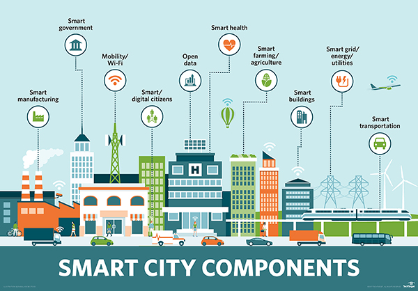
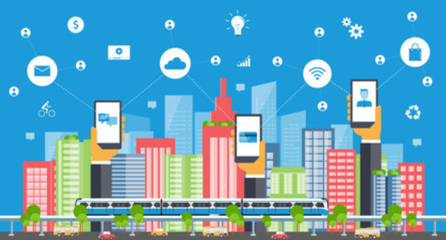

# Introducción a las Smart Cities

>Una ciudad inteligente es un área urbana que utiliza **diferentes tipos de sensores electrónicos** de recopilación de datos para suministrar información utilizada para administrar recursos de manera eficiente. Esto incluye datos recopilados de **ciudadanos, dispositivos** y activos que se procesan y analizan para monitorear y administrar el tráfico y los sistemas de transporte, centrales eléctricas, redes de suministro de agua, gestión de desechos, cumplimiento de la ley, sistemas de información, escuelas, bibliotecas, hospitales y otros **servicios** comunitarios.

>[https://es.wikipedia.org/wiki/Ciudad_inteligente](https://es.wikipedia.org/wiki/Ciudad_inteligente)

## **Smart cities** es tecnología de la información

### **Smart city:** ejemplo Barcelona

Barcelona ha establecido una serie de proyectos que pueden considerarse aplicaciones de 'ciudad inteligente' dentro de su estrategia ["CityOS"](https://ajuntament.barcelona.cat/imi/es/proyectos/cityos). Por ejemplo, se ha implementado **tecnología de sensores en el sistema de riego** del Parc del Centre de Poblenou, donde se transmiten datos en tiempo real a los equipos de jardinería sobre el nivel de agua necesario para las plantas. Barcelona también ha diseñado una **nueva red de autobuses** basada en el análisis de datos de los flujos de tráfico más comunes en Barcelona, ​​utilizando principalmente rutas verticales, horizontales y diagonales con una serie de intercambios. La integración de múltiples tecnologías de ciudades inteligentes se puede ver a través de la implementación de **semáforos inteligentes**, ya que los autobuses recorren rutas diseñadas para optimizar el número de semáforos en verde. Además, cuando se **notifica una emergencia** en Barcelona, ​​la ruta aproximada del vehículo de emergencia se ingresa en el sistema de semáforos, poniendo todas las luces en verde a medida que el vehículo se acerca a través de una combinación de GPS y software de gestión de tráfico, lo que permite que los servicios de emergencia llegar al incidente sin demora. Gran parte de estos datos son administrados por la [Plataforma Sentilo](https://www.sentilo.io/).

[https://en.wikipedia.org/wiki/List_of_smart_cities#Barcelona](https://en.wikipedia.org/wiki/List_of_smart_cities#Barcelona)

## **Smart cities** también es comportamiento humano

En las Smart Cities no es sólo el componente tecnológico, también es muy importante el componente humano. Una ciudad podrá ser calificado de inteligente en la medida que las inversiones que se realicen en capital humano (educación), en aspectos sociales, ​en infraestructuras de energía,​ tecnologías de comunicación e infraestructuras de transporte,​ contemplen y promuevan una calidad de vida elevada, un desarrollo económico-ambiental durable y sostenible, una gobernanza participativa,​ una gestión prudente y reflexiva de los recursos naturales, así como un buen aprovechamiento del tiempo de los ciudadanos. 

Tecnológicamente una Smart City se base en un conjunto de servicios (web) especializados

Si estos servicios contienen una componente geográfica (coordenadas), hablaremos de **GeoServicios**.

## ¿Qué es un servicio y para qué sirve?

Un servicio es una interfaz que recibe parámetros + valores y devuelve una respuesta formateada.

Los parámetros y repuestas son conocidos y están documentados en formato de API.

### API - Application Programming Interface

La interfaz de programación de aplicaciones, conocida también por la sigla **API**,​ es un conjunto de subrutinas, funciones y procedimientos que ofrece cierta biblioteca para ser utilizada por otro software. [^1]

El término API se usa a menudo para referirse a las **API web**, que permiten la comunicación entre computadoras que están unidas por Internet. También hay API para lenguajes de programación, bibliotecas de software, sistemas operativos de computadora y hardware de computadora.

La documentación de la API generalmente se proporciona para facilitar el uso.

Webs con enlaces a diferentes APIs

https://rapidapi.com/

https://apislist.com/

### HTTP

El protocolo HTTP tiene diferentes métodos de interrogación.

* GET
* POST
* UPDATE
* DELETE
* INSERT

!!! note 

    HTTP - GET es el más usado en APIs web

#### Tipos de peticiones HTTP - GET

**KvP: (Key value Pair)**: después del **?** pasamos parámetro = valor y concatenamos con **&**.

Ejemplo: http://midominio.com/servidor/enpoint?parametro1=valor1&parametro2=valor=2

**RESTful**: la URL define el recurso, dentro de una arquitectura REST.

Ejemplo: http://midominio.com/servidor/recurso.json

**RESTful and KvP**: la URL define el recurso, pero podemos filtrar recurso con parámetros.

Ejemplo: http://midominio.com/servidor/recurso.json?parametro1=valor1 (Utilizada en APIs OpenData)  

Muchos servicios y/o información relativa a Smart City, son expuestos  cómo OpenData (Datos Abiertos) en portales de administraciones públicas. Son las llamadas “Plataformas“ para la publicación y gestión de Open data.

Temario

* Introducción a las Smart Cities
    * Conceptos Smart Cities
    * Conceptos Open Data
    * Conceptos sensores
    * Tecnologías OpenData
    
## Referencias
[^1]: https://es.wikipedia.org/wiki/Interfaz_de_programaci%C3%B3n_de_aplicaciones