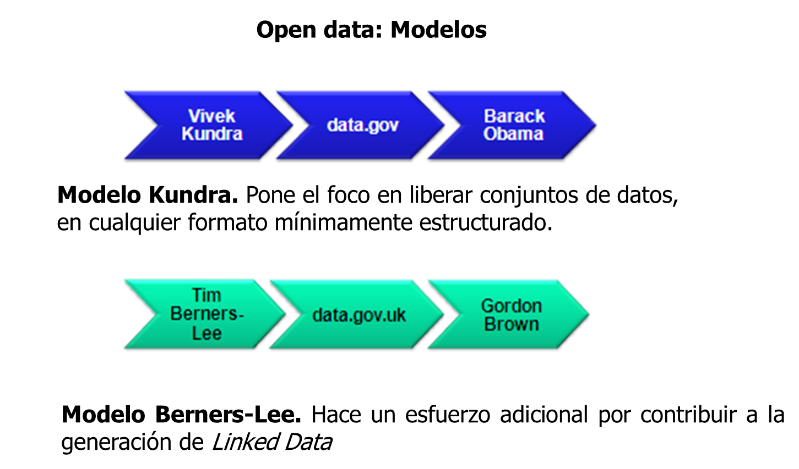
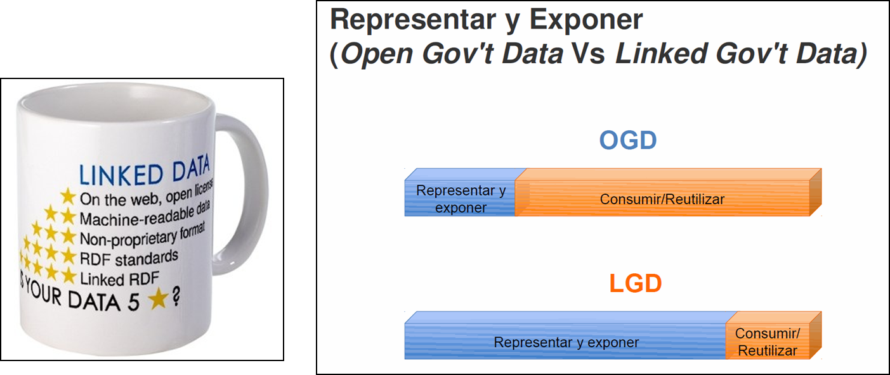
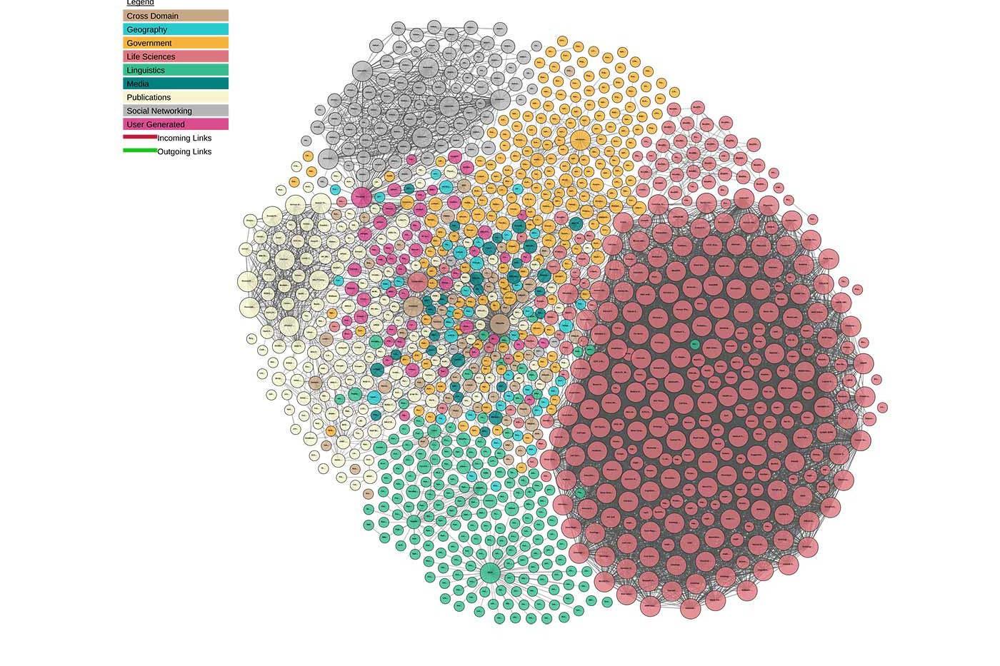
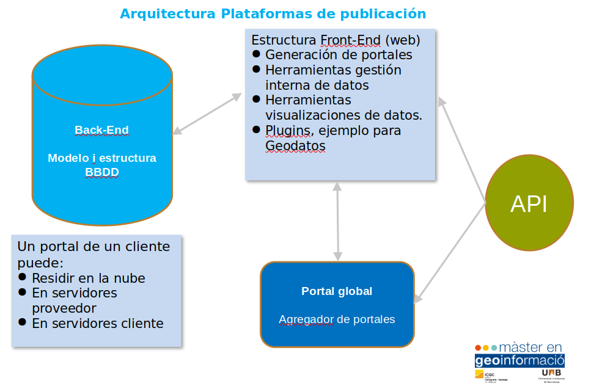

# Introducción al Open data

El concepto **datos abiertos** (**open data**, en inglés) es una filosofía y práctica que persigue que determinados tipos de datos estén disponibles de forma libre para todo el mundo, sin restricciones de derechos de autor, de patentes o de otros mecanismos de control.​ Tiene una ética similar a otros movimientos y comunidades abiertos, como el software libre, el código abierto (open source, en inglés) y el acceso libre (open access, en inglés). [^1]

## Modelos Open data

### Representar y Exponer

Las nuevas plataformas de publicación de Open data equilibran la barra de los esfuerzos entre representar/exponer y consumir/reutilizar.

:star: publica tus datos en la Web (con cualquier formato) y bajo una licencia abierta

:star: :star: publícalos como datos estructurados (ej: Excel en vez de una imagen de una tabla escaneada)

:star: :star: :star: usa formatos no propietarios (ej: CSV en vez de Excel)

:star: :star: :star: :star: usa URIs para denotar cosas, así la gente puede apuntar a estas

:star: :star: :star: :star: :star: enlaza tus datos a otros datos para proveer contexto

## Linked data

En informática, los datos enlazados o datos vinculados (a menudo referidos en inglés como linked data) describe un método de publicación de datos estructurados para que puedan ser interconectados y más útiles. Se basa en tecnologías Web estándar, tales como HTTP, RDF, RDFa y los URI,​ pero en vez de utilizarlos para servir páginas web para los lectores humanos, las extiende para compartir información de una manera que puede ser leída automáticamente por ordenadores. Esto permite que sean conectados y consultados datos de diferentes fuentes.[^2]

https://lod-cloud.net/

## Plataformas Open data

### Socrata

Socrata era una empresa de software adquirida por Tyler Technologies en 2018. Socrata proporciona herramientas de visualización y análisis de datos basadas en la nube para abrir datos gubernamentales. Originalmente llamada Blist, Socrata se fundó en febrero de 2007. Socrata se dirige a usuarios de Internet no técnicos que desean ver y compartir datos gubernamentales, de salud, energía, educación o medio ambiente. Sus productos se emiten bajo una licencia propietaria, cerrada y exclusiva.

**Sede:**  Seattle, Washington, USA

**Fundada:** 2007 

**Modelo negocio:** Software-as-a-Service bajo licencia. API y SDK’s (acceso a datos) OpenSource.

https://www.tylertech.com/products/socrata

http://dev.socrata.com/

https://github.com/socrata

**Portal global:** https://www.opendatanetwork.com

**Discovery API:** https://socratadiscovery.docs.apiary.io/#

**SODA API (Socrata Open Data API):** https://dev.socrata.com/consumers/getting-started.html

#### Portales con Socrata:

https://analisi.transparenciacatalunya.cat/

https://opendata.rubi.cat/es/browse

### OpenDataSoft

OpenDataSoft es una empresa privada de software especializada en transformar datos estructurados en API y visualizaciones. Fundada en 2011, OpenDataSoft se dirige a usuarios no técnicos que desean compartir y visualizar datos gubernamentales, de salud, energéticos y medioambientales. OpenDataSoft permite ecosistemas de intercambio restringido y abierto como portales de datos abiertos.

**Sede:**  Paris, Fr

**Fundada:** 2011 

**Modelo negocio:** Software-as-a-Service bajo licencia. API y SDK’s (acceso a datos) OpenSource. Gratuito para “nonprofit” y ONG

https://www.opendatasoft.com/

https://www.opendatasoft.com/open-data-solutions/

https://github.com/opendatasoft

**Portal global:** https://public.opendatasoft.com/explore/?sort=modified

**API:** https://public.opendatasoft.com/api/v1/console/datasets/1.0/search/

### Ckan

Open Knowledge International (OKI) (conocida como Open Knowledge Foundation (OKF) hasta abril de 2014, luego Open Knowledge hasta mayo de 2016) es una red global sin fines de lucro que promueve y comparte información sin cargo, incluida tanto el contenido como los datos. Fue fundada por Rufus Pollock el 24 de mayo de 2004 en Cambridge, Reino Unido.

**Sede:**  Cambrigde, UK

**Fundada:** 2004

**Modelo negocio:** Fundación Open Knowledge International. Todo OpenSource pero también ofrecen servicio (de pago) de Hosting.

https://ckan.org

https://github.com/ckan/ckan

https://datahub.io

**Portal global:** http://dataportals.org/

**API:** http://docs.ckan.org/en/latest/api/index.html

* CKAN es OpenSource
* Puedo instalarlo en mi servidor o utilizar servicio web
* Puedo automatizar la gestión de datasets
* Todos los Datasets están expuestos via API

#### Ejemplos API 

Listado de portales con CKAN
http://dataportals.org/api/data.json/

Museos de Barcelona
https://opendata-ajuntament.barcelona.cat/data/api/3/action/package_search?q=museu

Barrios Barcelona
https://opendata-ajuntament.barcelona.cat/data/api/3/action/resource_search?query=description:barri

#### Portales con Ckan:

https://opendata-ajuntament.barcelona.cat/

https://www.seu-e.cat/es/web/rubi/dades-obertes

https://data.gov.uk/

## Referencias

[^1]: https://es.wikipedia.org/wiki/Datos_abiertos
[^2]: https://es.wikipedia.org/wiki/Datos_enlazados
