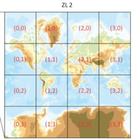

# Conceptos Vector Tiles

Vector Tiles es un formato para almacenar datos geográficos en formato binario (Google Protobuf) y pensados para la visualización en navegadores web modernos que soporten webGL.

Una tesela vectorial (vector tiles) contiene datos vectoriales georreferenciados (puede contener múltiples capas), recortados en teselas para facilitar su recuperación. Son equivalentes a las teselas raster tradicionales (XYZ,WMTS, TMS) pero retornan datos vectoriales en lugar de una imagen raster.

 Cada conjunto de teselas vectoriales tiene su propio esquema. Un esquema consiste en nombres de capas, atributos, selección de elementos.

 *Ejemplo mapa raster*

 [https://openicgc.github.io/exemples/leaflet/icgc-raster-leaflet-map.html](ttps://openicgc.github.io/exemples/leaflet/icgc-raster-leaflet-map.html)

 *Ejemplo mapa vector*

 [https://openicgc.github.io/exemples/maplibre/icgc-basemap-maplibre-map.html#7.4/41.706/1.146](https://openicgc.github.io/exemples/maplibre/icgc-basemap-maplibre-map.html#7.4/41.706/1.146)

## Contexto

 En 2005 GoogleMaps introdujo una "nueva" forma de mostrar datos geográficos por la web, pregenerando el mapa por niveles de zoom y tiles (teselas) de 256x256 pixeles.

También creó una nueva proyección basada en mercator, llamada pseude-mercator o [web mercator](https://en.wikipedia.org/wiki/Web_Mercator_projection), cuyo código EPSG es 3857

 Después de GoogleMaps, otros proveedores o plataformas cómo OpenStreetMap siguen esta misma forma de organizar la geoinformación.

## Protocolos

 Para cargar la imágenes se ulitza una llamada HTTP rest dónde se especifica;
 
> https://.../.../z/x/y.format

> Z= Nivel de zoom

> X=coordenada X

> Y=coordenada Y

> Formato 

>   Raster: Imágen png o JPEG

>   Vector: (pbf o mvt)

## Protocolos

Existen tres especificaciones para servir tiles

* TMS (Tile Map Service): X Y coordenadas empiezan de debajo  izquierda (típico eje cartesiano de coordenadas)

* WMTS (Web Map Tile Service): OGC estandard , corrdenadas empiezan de arriba izquierda.

* ZXY o "slippy map": Igual que TMS pero la Y empieza por arriba izquierda

### Caracteristicas

Las teselas vectoriales han sido utilizadas por el cliente Android de Google Maps desde diciembre de 2010 y en el cliente de escritorio desde 2013. Las teselas vectoriales para renderizar los datos de OpenStreetMap se propusieron por primera vez en marzo de 2013 y están soportadas por Mapnik, el renderizador de datos de OpenStreetMap más utilizado. 
Mapbox, proveedor comercial de herramientas de cartografía personalizada y de hosting, es el máxini impulsor de esta tecnologia y ha centrado su herramienta de cartografía, Mapbox Studio, en torno a las teselas vectoriales.

 * Cada tile es un contenedor de datos vectores y atributos
 * Los Tiles no tienen estilo, el estilo se aplica en cliente
 * Soporta rotación y orientación
 * Soporta extrusión y 3D

## Ejemplos en accion

https://openicgc.github.io/

## Herramientas y recursos

Fuente:
[https://github.com/mapbox/awesome-vector-tiles](https://github.com/mapbox/awesome-vector-tiles)

## Taller

https://geoinquiets.github.io/taller-vt/

## License

