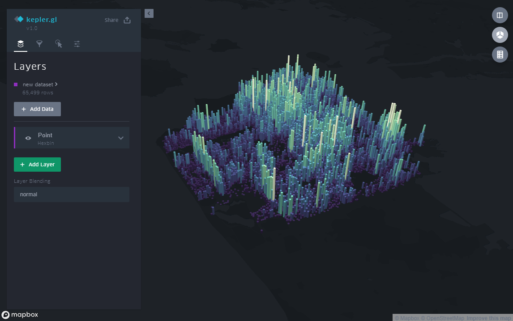
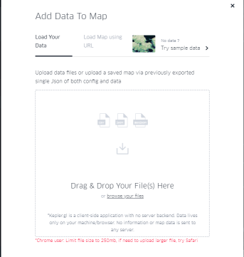
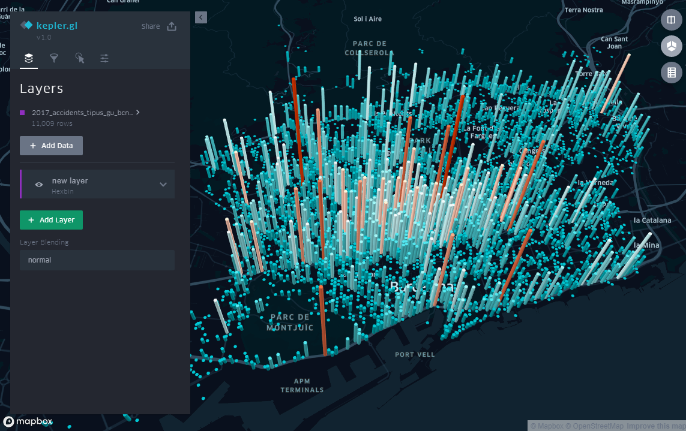

# Visualización con Kepler.gl

Kepler.gl desarrollada por Uber, en un principio para uso interno, para analizar y visualizar sus propios datos.

Es una aplicación basada en web GL de alto rendimiento y agnóstica de datos para la exploración visual de conjuntos de datos de geolocalización a gran escala. Construido en la parte superior de deck.gl, kepler.gl puede representar millones de puntos que representan miles de viajes y realizar agregaciones espaciales sobre la marcha.

## Ejercicio de visualización con Kepler.gl

!!! tip 
    Queremos ver dónde hay más accidentes

* Descargamos dataset CSV de [OpenData BCN](http://opendata-ajuntament.barcelona.cat/data/ca/dataset/accidents-tipus-gu-bcn)

* Vamos a http://kepler.gl/#/demo 

>  `Añadimos csv`

> `Add Layer: Type Hexbin`

> `Columns: Latitud Longuitud`

> `Color: Scale Quantize`

> `Hexagon radius 0.1`

> `Coverage 0.75`

!!!Info 
    Continuamos añadiendo más capas y mapas bases